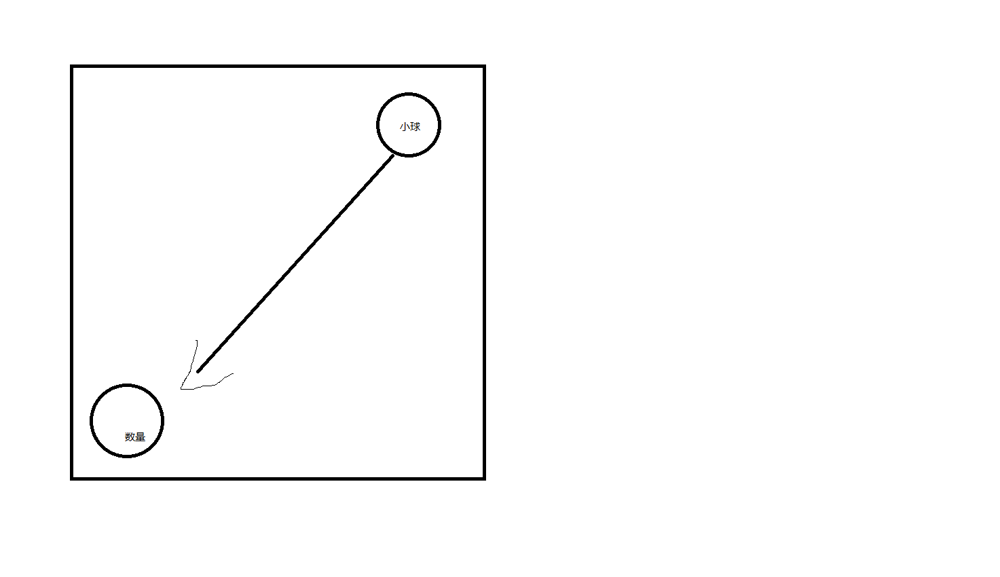
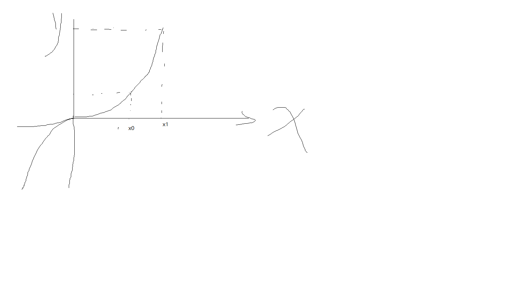

## 实现加入购物车效果

> 前言加入购物车功能，在商城类移动端或 app 上经常出现。增加了体验，在此基础上自己封装一个来实现。

### 1.原理

点击商品显示一个小球，从商品出发到达数量 box，且小球得大小逐渐变小。


### 2.如何实现抛物运动

-   1.认识 tween 函数
-   2.tween与小球的位置关系
-   3.获取小球起始点方法
-   4.定时器函数更新小球位置

#### 2.1 tween 函数

tween 主要是利用数学公式让数值从某个值变为某个值用线性关系表示出来，如(y=x)当然不仅仅如此简单，主要得有

Linear ==> 线性匀速运动效果
Quadratic ==> 二次方的缓动（t^2）
Cubic ==> 三次方的缓动（）
Quartic ==> 四次方的缓动（）
Quintic ==> 五次方的缓动
Sinusoidal ==> 正弦曲线的缓动（）
Exponential ==> 指数曲线的缓动（）
Circular ==> 圆形曲线的缓动（）
Elastic ==> 指数衰减的正弦曲线缓动（）
Back ==> 超过范围的三次方的缓动
Bounce ==> 指数衰减的反弹缓动

```
//t 起始时间固定为0 d 持续时间默认300 b起始值 c变化量(如 0-> 100=(100-0=100),1->0=(0-1=-1))
let Tween = {
    Linear: function (t, b, c, d) {
        return c * t / d + b;
    },
    Quad: {
        easeIn: function (t, b, c, d) {
            return c * (t /= d) * t + b;
        },
        easeOut: function (t, b, c, d) {
            return -c * (t /= d) * (t - 2) + b;
        },
        easeInOut: function (t, b, c, d) {
            if ((t /= d / 2) < 1) return c / 2 * t * t + b;
            return -c / 2 * ((--t) * (t - 2) - 1) + b;
        }
    },
    Cubic: {
        easeIn: function (t, b, c, d) {
            return c * (t /= d) * t * t + b;
        },
        easeOut: function (t, b, c, d) {
            return c * ((t = t / d - 1) * t * t + 1) + b;
        },
        easeInOut: function (t, b, c, d) {
            if ((t /= d / 2) < 1) return c / 2 * t * t * t + b;
            return c / 2 * ((t -= 2) * t * t + 2) + b;
        }
    },
    Quart: {
        easeIn: function (t, b, c, d) {
            return c * (t /= d) * t * t * t + b;
        },
        easeOut: function (t, b, c, d) {
            return -c * ((t = t / d - 1) * t * t * t - 1) + b;
        },
        easeInOut: function (t, b, c, d) {
            if ((t /= d / 2) < 1) return c / 2 * t * t * t * t + b;
            return -c / 2 * ((t -= 2) * t * t * t - 2) + b;
        }
    },
    Quint: {
        easeIn: function (t, b, c, d) {
            return c * (t /= d) * t * t * t * t + b;
        },
        easeOut: function (t, b, c, d) {
            return c * ((t = t / d - 1) * t * t * t * t + 1) + b;
        },
        easeInOut: function (t, b, c, d) {
            if ((t /= d / 2) < 1) return c / 2 * t * t * t * t * t + b;
            return c / 2 * ((t -= 2) * t * t * t * t + 2) + b;
        }
    },
    Sine: {
        easeIn: function (t, b, c, d) {
            return -c * Math.cos(t / d * (Math.PI / 2)) + c + b;
        },
        easeOut: function (t, b, c, d) {
            return c * Math.sin(t / d * (Math.PI / 2)) + b;
        },
        easeInOut: function (t, b, c, d) {
            return -c / 2 * (Math.cos(Math.PI * t / d) - 1) + b;
        }
    },
    Expo: {
        easeIn: function (t, b, c, d) {
            return (t == 0) ? b : c * Math.pow(2, 10 * (t / d - 1)) + b;
        },
        easeOut: function (t, b, c, d) {
            return (t == d) ? b + c : c * (-Math.pow(2, -10 * t / d) + 1) + b;
        },
        easeInOut: function (t, b, c, d) {
            if (t == 0) return b;
            if (t == d) return b + c;
            if ((t /= d / 2) < 1) return c / 2 * Math.pow(2, 10 * (t - 1)) + b;
            return c / 2 * (-Math.pow(2, -10 * --t) + 2) + b;
        }
    },
    Circ: {
        easeIn: function (t, b, c, d) {
            return -c * (Math.sqrt(1 - (t /= d) * t) - 1) + b;
        },
        easeOut: function (t, b, c, d) {
            return c * Math.sqrt(1 - (t = t / d - 1) * t) + b;
        },
        easeInOut: function (t, b, c, d) {
            if ((t /= d / 2) < 1) return -c / 2 * (Math.sqrt(1 - t * t) - 1) + b;
            return c / 2 * (Math.sqrt(1 - (t -= 2) * t) + 1) + b;
        }
    },
    Elastic: {
        easeIn: function (t, b, c, d, a, p) {
            var s;
            if (t == 0) return b;
            if ((t /= d) == 1) return b + c;
            if (typeof p == "undefined") p = d * .3;
            if (!a || a < Math.abs(c)) {
                s = p / 4;
                a = c;
            } else {
                s = p / (2 * Math.PI) * Math.asin(c / a);
            }
            return -(a * Math.pow(2, 10 * (t -= 1)) * Math.sin((t * d - s) * (2 * Math.PI) / p)) + b;
        },
        easeOut: function (t, b, c, d, a, p) {
            var s;
            if (t == 0) return b;
            if ((t /= d) == 1) return b + c;
            if (typeof p == "undefined") p = d * .3;
            if (!a || a < Math.abs(c)) {
                a = c;
                s = p / 4;
            } else {
                s = p / (2 * Math.PI) * Math.asin(c / a);
            }
            return (a * Math.pow(2, -10 * t) * Math.sin((t * d - s) * (2 * Math.PI) / p) + c + b);
        },
        easeInOut: function (t, b, c, d, a, p) {
            var s;
            if (t == 0) return b;
            if ((t /= d / 2) == 2) return b + c;
            if (typeof p == "undefined") p = d * (.3 * 1.5);
            if (!a || a < Math.abs(c)) {
                a = c;
                s = p / 4;
            } else {
                s = p / (2 * Math.PI) * Math.asin(c / a);
            }
            if (t < 1) return -.5 * (a * Math.pow(2, 10 * (t -= 1)) * Math.sin((t * d - s) * (2 * Math.PI) / p)) + b;
            return a * Math.pow(2, -10 * (t -= 1)) * Math.sin((t * d - s) * (2 * Math.PI) / p) * .5 + c + b;
        }
    },
    Back: {
        easeIn: function (t, b, c, d, s) {
            if (typeof s == "undefined") s = 1.70158;
            return c * (t /= d) * t * ((s + 1) * t - s) + b;
        },
        easeOut: function (t, b, c, d, s) {
            if (typeof s == "undefined") s = 1.70158;
            return c * ((t = t / d - 1) * t * ((s + 1) * t + s) + 1) + b;
        },
        easeInOut: function (t, b, c, d, s) {
            if (typeof s == "undefined") s = 1.70158;
            if ((t /= d / 2) < 1) return c / 2 * (t * t * (((s *= (1.525)) + 1) * t - s)) + b;
            return c / 2 * ((t -= 2) * t * (((s *= (1.525)) + 1) * t + s) + 2) + b;
        }
    },
    Bounce: {
        easeIn: function (t, b, c, d) {
            return c - Tween.Bounce.easeOut(d - t, 0, c, d) + b;
        },
        easeOut: function (t, b, c, d) {
            if ((t /= d) < (1 / 2.75)) {
                return c * (7.5625 * t * t) + b;
            } else if (t < (2 / 2.75)) {
                return c * (7.5625 * (t -= (1.5 / 2.75)) * t + .75) + b;
            } else if (t < (2.5 / 2.75)) {
                return c * (7.5625 * (t -= (2.25 / 2.75)) * t + .9375) + b;
            } else {
                return c * (7.5625 * (t -= (2.625 / 2.75)) * t + .984375) + b;
            }
        },
        easeInOut: function (t, b, c, d) {
            if (t < d / 2) {
                return Tween.Bounce.easeIn(t * 2, 0, c, d) * .5 + b;
            } else {
                return Tween.Bounce.easeOut(t * 2 - d, 0, c, d) * .5 + c * .5 + b;
            }
        }
    }
}
```

当然这里有更主要得解释: [关于 tween 函数](https://www.zhangxinxu.com/wordpress/2016/12/how-use-tween-js-animation-easing/)

#### 2.2tween 函数与小球关系

我们只需要关注小球得起始点和末尾点，至于小球位置以何种线性变化完全可以交给 tween 函数。


#### 2.3 如何获取小球得起始位置

可以利用 dom.offsetLeft 获取，但 getBoundClientRect()兼容性比它更好，更推荐使用该函数获取其距离视口的宽高。

```
getBoundPos(obj = null) {
    return obj.getBoundingClientRect();
}
```

#### 2.4定时器函数更新小球位置
定时器函数在指定时间内执行tween函数返回值，来设置当前小球位置

```
let valueX = Tween[effect].easeOut(loopCount, startX, changedX, duration);
let valueY = Tween[effect].easeIn(loopCount, startY, changedY, duration);
let scalRate = Tween[effect].easeIn(loopCount,1,-1,duration);
dom.style.left = valueX + 'px';
dom.style.top = valueY + 'px';
dom.style.transform = `scale(${scalRate})`
```

### 3.完整的实现方法

```
class Fly {
    constructor(params = {}) {
        this.options = {
            dom: null, //飞翔得小球
            origin: null, //起点位置
            target: null, //终点
            effect: 'Quad',
            duration: 30, //循环时间
            onUpdate() { }, //更新中得回调
            onComplete() { },
            ...params

        };
        this.startX = this.getBoundPos(this.options.origin).left;
        this.startY = this.getBoundPos(this.options.origin).top;
        this.endX = this.getBoundPos(this.options.target).left;
        this.endY = this.getBoundPos(this.options.target).top;

        this.changedX = this.endX - this.startX;
        this.changedY = this.endY - this.startY;
        this.loopCount = 0; //起始时间
        this.interval = null;
    }
    init() {
        this.interval = setInterval(() => {
            this.updateTimer()
        }, 1000 / 60)

    }
    updateTimer() {
        let {
            options: {
                dom,
                effect,
                duration,
                onUpdate,
                onComplete
            },
            loopCount,
            startX,
            startY,
            changedX,
            changedY } = this;
        this.loopCount++
        let valueX = Tween[effect].easeOut(loopCount, startX, changedX, duration);
        let valueY = Tween[effect].easeIn(loopCount, startY, changedY, duration);
        let scalRate = Tween[effect].easeIn(loopCount,1,-1,duration);
        dom.style.left = valueX + 'px';
        dom.style.top = valueY + 'px';
        dom.style.transform = `scale(${scalRate})`
        if (this.loopCount <= duration) {
            onUpdate()
        } else {
            onComplete();
            clearInterval(this.interval)
        }
    }
    getBoundPos(obj = null) {
        return obj.getBoundingClientRect();
    }

}
```
[最后效果以及源码地址](https://codesandbox.io/s/affectionate-blackwell-vfg75)


