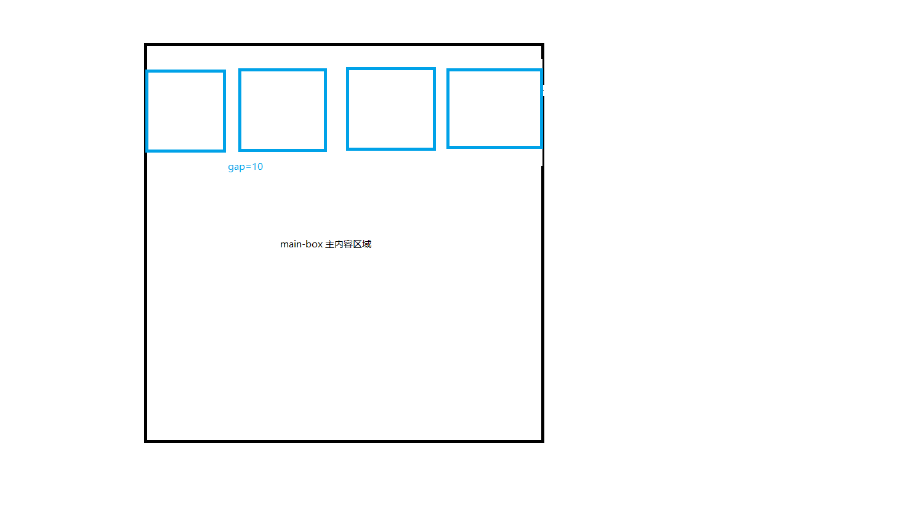

## 瀑布流效果类封装

> 前言：瀑布流，随着浏览器滚动，页面小单元逐渐出现，且位置是不规则的出现，常用在商城网站，图片类网站(花瓣网)等，十分美观。

### 1.瀑布流思路

#### 1.1 确定页面可以分多少栏目

根据主体区域的宽度/第一个小块的宽度，向下取整获取可以分多少栏目


```

let { items, gap,dom } = this; //gap 间距 动态传入
let oBoxWidth = dom.offsetWidth; //最外层box宽度
let itemWidth = items[0].offsetWidth; //子项
let colums = Math.floor(oBoxWidth / (itemWidth + gap)); //获取行数目
```

#### 1.2 加载的时候，如何把图片插入到上一行高度最低的那一行

瀑布流最大的思路是如何确定好小块的排序位置，一个数据列表如何按照规则往下排。
使用 Math.min.apply(null,arr) 确定最小索引。


```
let { items, gap,dom } = this;
let oBoxWidth = dom.offsetWidth;
let itemWidth = items[0].offsetWidth;
let colums = Math.floor(oBoxWidth / (itemWidth + gap)); //获取行数目
let arr = [], //新建数组和当前最小下标
    minIndex;
for (let i = 0; i < items.length; i++) {
    //第一行正常排序
    if (i < colums) {
    items[i].style.top = 0;
    items[i].style.left = i * (itemWidth + gap) + "px";

    arr.push(items[i].offsetHeight);
    } else {
    //第一行以后
    minIndex = this.getMinIndex(arr); //注意
    items[i].style.left = items[minIndex].offsetLeft + "px";
    items[i].style.top = arr[minIndex] + gap + "px";
    arr[minIndex] = arr[minIndex] + items[i].offsetHeight + gap;
    }
}


getMinIndex() {
    let minHeight = Math.min.apply(null, arr);
    return arr.findIndex(function (item) {
      return item === minHeight;
    });
}
```

#### 1.3 页面滚动到底部加载下一页数据，执行回调函数

封装的该类，接收一个回调函数，当确定要滚动下一页数据时触发。
条件为: (页面高度+页面滚动条高度>=最后一元素的offsetTop)


```
class waterFull {
    constructor({ dom = null, gap = 10, canScrollFn = () => { } }) {
    this.dom = dom;
    this.gap = gap;
    this.items = this.dom.children;
  }
   scrollFn() {
    let { items } = this;
    let canscroll =
      this.getScroll() + this.getClient().height >=
      items[items.length - 1].offsetTop;

    if (canscroll) {

      this.canScrollFn()
    }
  }

  getClient() {
    return {
      width:
        document.body.clientWidth ||
        document.documentElement.clientWidth ||
        window.innerWidth,
      height:
        document.body.clientHeight ||
        document.documentElement.clientHeight ||
        window.innerHeight
    };
  }
  getScroll() {
    return window.pageYOffset || document.documentElement.scrollTop;
  }
}

```

### 2.问题，页面初始化，拿不到图片的高度问题。
经过以上分析和调整基本可以实现一个瀑布流类。
```
class WaterFull {
  constructor({ dom = null, gap = 10, canScrollFn = () => { } }) {
    this.dom = dom;
    this.gap = gap;
    this.items = this.dom.children;
   
  
    this.canScrollFn = canScrollFn;
    this.init()
    this.wScroll();
    this.wResize();
  }
  init() {
    this.waterInit();
  }
  wResize() {
    let that = this;
    window.onresize = function () {
      that.init()
    };
  }
  wScroll() {
    
    let that = this;
    window.onscroll = throttle(function(){
      that.scrollFn()
    },100)
  }

  waterInit() {

    let { items, gap,dom } = this;
    let oBoxWidth = dom.offsetWidth;
    let itemWidth = items[0].offsetWidth;
    let colums = Math.floor(oBoxWidth / (itemWidth + gap)); //获取行数目
    let arr = [],
      minIndex;
    for (let i = 0; i < items.length; i++) {
      //第一行
      if (i < colums) {
        items[i].style.top = 0;
        items[i].style.left = i * (itemWidth + gap) + "px";
        
        arr.push(items[i].offsetHeight);
      } else {
        //第一行以后
        minIndex = this.getMinIndex(arr);
        items[i].style.left = items[minIndex].offsetLeft + "px";
        items[i].style.top = arr[minIndex] + gap + "px";
        arr[minIndex] = arr[minIndex] + items[i].offsetHeight + gap;
      }
    }

  }
 
  scrollFn() {
    let { items } = this;
    let canscroll =
      this.getScroll() + this.getClient().height >=
      items[items.length - 1].offsetTop;

    if (canscroll) {
      this.canScrollFn()
    }
  }

  getMinIndex(arr) {
    let minHeight = Math.min.apply(null, arr);
    return arr.findIndex(function (item) {
      return item === minHeight;
    });
  }
  getClient() {
    return {
      width:
        document.body.clientWidth ||
        document.documentElement.clientWidth ||
        window.innerWidth,
      height:
        document.body.clientHeight ||
        document.documentElement.clientHeight ||
        window.innerHeight
    };
  }
  getScroll() {
    return window.pageYOffset || document.documentElement.scrollTop;
  }
}
```
但随之而来的是，当我们在vue里面初始话时候,函数不执行(图片堆叠在一起，没有正确的分栏)，经调试发现每一个box有宽度没有高度，所以没每一个box无法正确的定位。

#### 2.1vue在mounted时候，无法获取图片的正常高度。
渲染时是同步渲染的，所以只有图片onload时候才会有高度，但是一个页面有很多图片不可能每一个onload都触发init函数，这个时候可以利用一个闭包来合并执行，不需要多次触发，收集所有的触发条件，归为依次触发即可
```
let proxySync = (function() {
    let cache = [], // 保存一段时间内需要同步的 ID
        timer; // 定时器
    return function(id) {
        cache.push(id);
        if (timer) {
            // 保证不会覆盖已经启动的定时器
            return;
        }
        timer = setTimeout(function() {
            callBack.apply(this,arguments) //回调摆正this
            clearTimeout(timer); // 清空定时器
            timer = null;
            cache.length = 0; // 清空 ID 集合
        }, 500);
    };
})();
```

### 3.优化加载问题
为了避免页面滚动触发太过于频繁，可以使用节流函数优化scrool，关于节流的原理和实现，大家可以参考
[节流](https://github.com/xiuxiumomo/learn-js/blob/master/JavaScript/book/javascript%E8%AE%BE%E8%AE%A1%E6%A8%A1%E5%BC%8F/%E7%AC%AC%E4%B8%89%E7%AB%A0%E9%97%AD%E5%8C%85%E5%92%8C%E9%AB%98%E9%98%B6%E5%87%BD%E6%95%B0.md)

最终得到的结果
```

var throttle = function (callBack, time=500) {
  var prev = Date.now(),
      first = true;
  return function () {
      if (first) {
          callBack.apply(this, arguments);
          return first = false;
      }
      var now = Date.now();
      if (now - prev >= time) {
          callBack.apply(this, arguments);
          prev = Date.now();
      }
  }
}
/**
 * dom 最外层的box gap 间距 canScrollFn 滑到最底部的回调
 */

class WaterFull {
  constructor({ dom = null, gap = 10, canScrollFn = () => { } }) {
    this.dom = dom;
    this.gap = gap;
    this.items = this.dom.children;
   
  
    this.canScrollFn = canScrollFn;
    this.init()
    this.wScroll();
    this.wResize();
  }
  init() {
    this.waterInit();
  }
  wResize() {
    let that = this;
    window.onresize = function () {
      that.init()
    };
  }
  wScroll() {
    
    let that = this;
    window.onscroll = throttle(function(){
      that.scrollFn()
    },100)
  }

  waterInit() {

    let { items, gap,dom } = this;
    let oBoxWidth = dom.offsetWidth;
    let itemWidth = items[0].offsetWidth;
    let colums = Math.floor(oBoxWidth / (itemWidth + gap)); //获取行数目
    let arr = [],
      minIndex;
    for (let i = 0; i < items.length; i++) {
      //第一行
      if (i < colums) {
        items[i].style.top = 0;
        items[i].style.left = i * (itemWidth + gap) + "px";
        
        arr.push(items[i].offsetHeight);
      } else {
        //第一行以后
        minIndex = this.getMinIndex(arr);
        items[i].style.left = items[minIndex].offsetLeft + "px";
        items[i].style.top = arr[minIndex] + gap + "px";
        arr[minIndex] = arr[minIndex] + items[i].offsetHeight + gap;
      }
    }

  }
 
  scrollFn() {
    let { items } = this;
    let canscroll =
      this.getScroll() + this.getClient().height >=
      items[items.length - 1].offsetTop;

    if (canscroll) {
      this.canScrollFn()
    }
  }

  getMinIndex(arr) {
    let minHeight = Math.min.apply(null, arr);
    return arr.findIndex(function (item) {
      return item === minHeight;
    });
  }
  getClient() {
    return {
      width:
        document.body.clientWidth ||
        document.documentElement.clientWidth ||
        window.innerWidth,
      height:
        document.body.clientHeight ||
        document.documentElement.clientHeight ||
        window.innerHeight
    };
  }
  getScroll() {
    return window.pageYOffset || document.documentElement.scrollTop;
  }
}
export default WaterFull;

```
[整个项目的案列](https://codesandbox.io/s/cranky-cray-pw1le)
