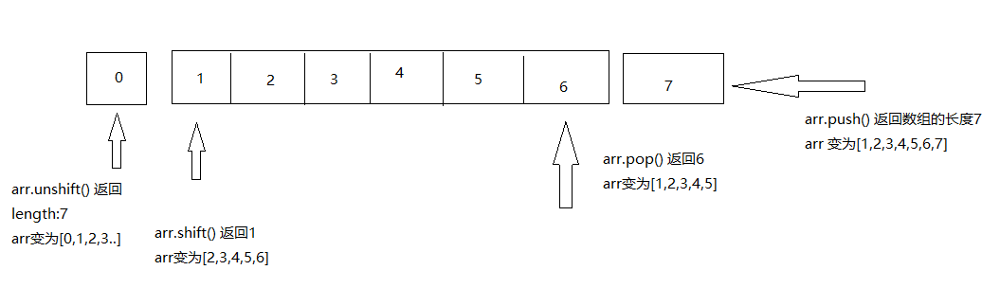

## 总结一下数组 Array 常用的方法和特性

> 前言数组是 javascript 种一个非常重要的数据结构。数组是一个有序的数据集合，使用数组名称和索引进行访问。

## 1.创建数组

```
let arr = [];
let arr = new Array();
let arr = Array();
```

### 2.使用数组

### 2.1 简单的使用数组

```
let arr = [1,2,3];
a[0] //1
arr.length //3
```

### 2.2 了解数组 length 属性

-   数组的索引值从 0 开始，从 0 开始一次增加 1
-   数组的 length 永远返回数组最后一个元素的索引值+1
-   可通过 arr.length =0;来清空数组
-   可通过 arr.length = len 来设置数组长度。

### 2.3 遍历数组

-   for 循环
-   使用 for in 遍历
-   使用 forEach 遍历

```
let arr = [1,2,3];
for(let i=0;i<arr.length;i++){
    console.log(arr[i])
}
for(let i in arr){
    console.log(arr[i])
}
arr.forEach((item)=>{
    console.log(item)
})
```

## 3.数组的方法

### 3.1 concat()和 join()

> concat 一个数组与另一个或多个数组合并组成新数组，join 把数组的所有元素放入一个字符串。元素通过指定的分隔符进行分隔。

-   arr.concat(arr1,arr2,...);
-   arr.join(str)

```
let arr = [1,3];
arr.concat([4,5]);
arr.join('-')
```

### 3.2 pop()和 push()

-   pop():删除并返回数组的最后一个元素，原数组会改变。
-   push(item):向数组的尾部添加一个或多个元素，改变原数组，返回的是新数组的长度

```
let arr = [1,2,3];
console.log(arr,arr.pop()); //[1,2] 3

let len = arr.push(4)
console.log(len,arr) //4, [1,2,3,4]
```

### 3.3 shift()和 unshift()

-   shift(): 删除并返回数组的第一个元素，改变元素组。
-   unshift(): 从数组的头部插入一个元素并返回数组的长度。



### 3.4 reserve() 颠倒数组的顺序

```
let arr = [1,3,4,5];
arr.reserve() //[5,4,3,1]
```

### 3.5 slice()和 splice()

-   slice(start,[end]) 提取指定位置的片段返回数组，原数组不变。[start,end)
-   splice(start,num) 删掉数组中指定位置的元素并返回成数组。原数组会改变。

```
let arr = [1,2,3,4];
arr.slice(1,3) //[2,3]

arr.splice(1,3) // [2,3]
```

### 3.6indexOf()

-   indexOf(ele,[,start]) 查找数组中是否含有某个元素，如果没有则返回-1

## 4.数组迭代方法

-   forEach() 遍历循环
-   every() 数学中的与命题,必须全部为真返回真。
-   some() 数学中的或命题,存在某个为真返回真。
-   filter() 过滤数组的每一项，返回符合条件的集合(漏斗)
-   map() 返回一个由回调函数的返回值组成的新数组。
-   reduce() 从左到右为每个数组元素执行一次回调函数，并把上次回调函数的返回值放在一个暂存器中传给下次回调函数，并返回最后一次回调函数的返回值。

```
let arr = [1,2,3];
let is_true = arr.every((item)=>{
    return item>0;
})
console.log(is_true) //true
let arr_2 = arr.filter((item)=>{
    return item>=2;
})
// [2,3]
let map_arr = arr.map((item)=>{
    return item*2;
})
// map_arr [2,4,6]
注意以上行为均不改变原来的数组
```

## 5.ES6 新增数组方法

-   keys() 返回下标集合
-   values() 返回元素值的集合
-   entries() 返回键值对集合
-   find() 找到第一个满足测试函数元素的那个值，找不到返回 undefind
-   findIndex() 找打第一个满足测试函数的元素的索引，找不到返回-1；

```
//重点讲一下find findIndex
let arr = [1,2,3];
let item = arr.find((item)={
    return item==1
})
let item_index = arr.findIndex((item)={
    return item==1
})
// item 1 item_index 0
let arr = [
    {
        id: 1,
        name: 'lee'
    },
    {
        id: 2,
        name: 'jack
    }
]
let item = arr.find((item)=>{
    return item.id==1;
})
//item {id:1,name:'lee'}


```

## 数组的扩展 ES6

-   (...)运算 浅拷贝对象
-   Array.from() 将类数组转变成真正的数组
-   Array.of() 将一组数值转变成数组
-   includes() 返回 Boolean 值，判断数组中是否包含元素

```
let arr = [1,2,3];
let arr2 = [...arr];
let a = {
    '0': 'lee',
    '1': 'jack',
    length: 2
}
let arr = Array.from(a) //变为数组
Array.of(1,2,3) // [1,2,3]
[1,23,4].includes(1) //
```

## Set 对象

> Set 数据结构类似数组，但是所有成员的值*唯一*。常用来去重(单数据而不是对象数据)

```
let arr = [1,2,2,3,4,5];
let arr_2 = Array.from(new Set(arr));
```

## 数组的交集并集差集

```
let a = [1,2,3,4,6];let b = [1,2,3,4,5,7];
//差集
function difference(a, b) {
    let array = Array.from(new Set([...a,...b]))
    return array.filter(v => !a.includes(v) || !b.includes(v))
}
//交集
function commonArray(a,b) {
    let array = Array.from(new Set([...a,...b]))
    return array.filter(v => a.includes(v) && b.includes(v))
}
//并集
function allArray(a,b) {
    let array = Array.from(new Set([...a,...b]))
    return array
}
```

注明：该文章是在原文[前端自习课](https://mp.weixin.qq.com/s/-HPtViPA926BwNp599555w)修改而得，感谢原作者！
